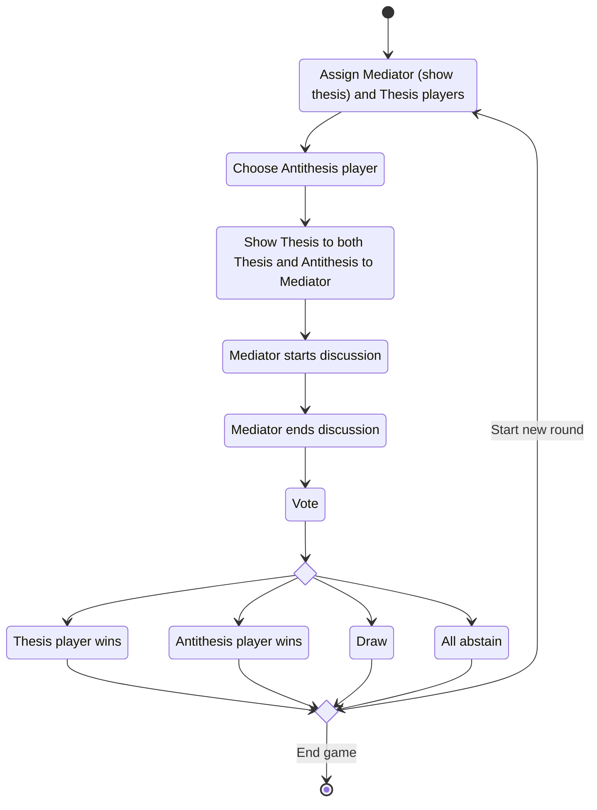

```mermaid
stateDiagram-v2
    state "Assign Mediator (show thesis) and Thesis players" as s1
    state "Choose Antithesis player" as s2
    state "Show Thesis to both Thesis and Antithesis to Mediator" as s3
    state "Mediator starts discussion" as s4
    state "Mediator ends discussion" as s5
    state "Vote" as s6
    state vote_outcome <<choice>>
    state "Thesis player wins" as s7
    state "Antithesis player wins" as s8
    state "Draw" as s9
    state "All abstain" as s10
    state turn_check <<choice>>

    [*] --> s1
    s1 --> s2
    s2 --> s3
    s3 --> s4
    s4 --> s5
    s5 --> s6
    s6 --> vote_outcome
    vote_outcome --> s7
    vote_outcome --> s8
    vote_outcome --> s9
    vote_outcome --> s10
    s7 --> turn_check
    s8 --> turn_check
    s9 --> turn_check
    s10 --> turn_check
    turn_check --> s1 : Start new round
    turn_check --> [*] : End game
```